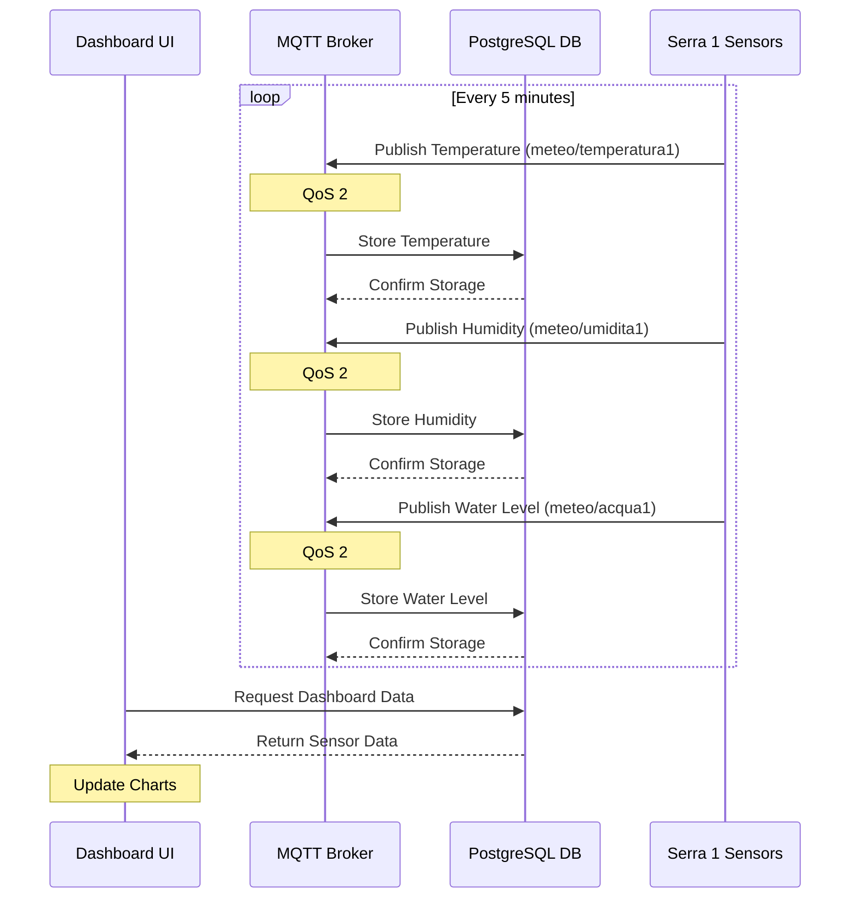
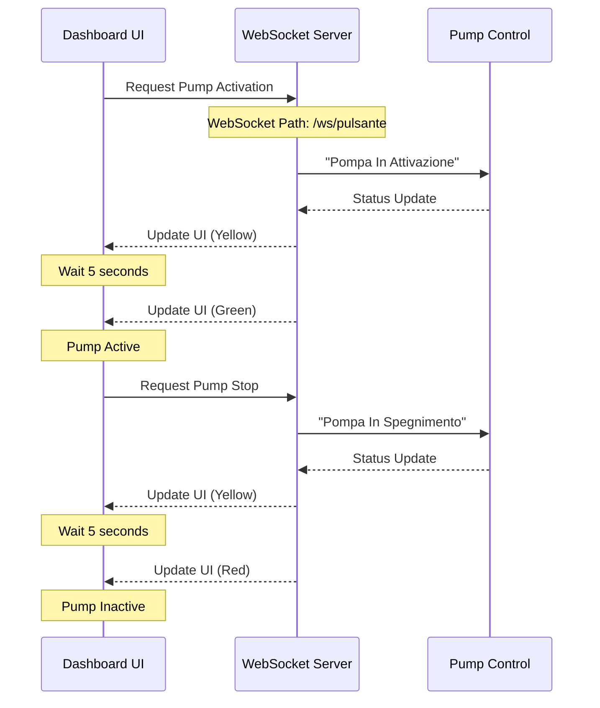

# Diagrammi di Sequenza Node-RED

## 1. Diagramma Monitoraggio Serra

### Spiegazione del Sistema di Monitoraggio

1. **Ciclo di Acquisizione Dati**
   - Frequenza: ogni 5 minuti
   - Sensori monitorati:
     * Temperatura (meteo/temperatura1)
     * Umidità (meteo/umidita1)
     * Livello acqua (meteo/acqua1)

2. **Flusso dei Dati**
   - I sensori pubblicano su topic MQTT dedicati
   - Utilizzo di QoS 2 per garantire la consegna
   - Salvataggio immediato su PostgreSQL
   - Conferma di memorizzazione

3. **Visualizzazione**
   - La Dashboard richiede i dati dal database
   - Aggiornamento dei grafici in tempo reale

## 2. Diagramma Controllo Pompa

### Spiegazione del Sistema di Controllo Pompa

1. **Attivazione Pompa**
   - L'utente richiede l'attivazione dalla UI
   - Il server WebSocket riceve la richiesta
   - Transizione attraverso stato "In Attivazione"
   - Feedback visivo:
     * Giallo durante la transizione (5 secondi)
     * Verde quando attiva

2. **Spegnimento Pompa**
   - L'utente richiede lo spegnimento dalla UI
   - Il server WebSocket riceve la richiesta
   - Transizione attraverso stato "In Spegnimento"
   - Feedback visivo:
     * Giallo durante la transizione (5 secondi)
     * Rosso quando inattiva

3. **Componenti Coinvolti**
   - **Dashboard UI**: Interfaccia utente web
   - **WebSocket Server**: Gestione comunicazione real-time
   - **Pump Control**: Sistema di attuazione

## Note Tecniche

1. **Protocolli di Comunicazione**
   - MQTT per i sensori (QoS 2)
   - WebSocket per il controllo pompa
   - SQL per la persistenza dei dati

2. **Sicurezza e Affidabilità**
   - Conferma di ricezione per ogni misurazione
   - Stati di transizione per evitare cambi di stato bruschi
   - Feedback visivo per ogni operazione

3. **Temporizzazioni**
   - Ciclo sensori: 5 minuti
   - Transizioni pompa: 5 secondi 