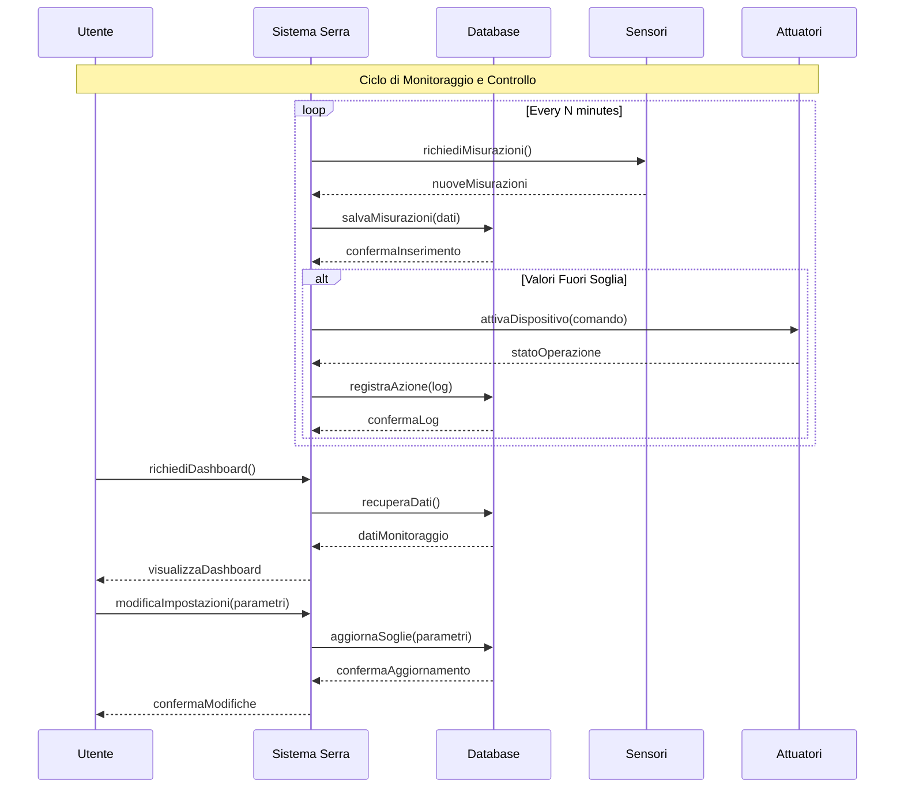

# Diagramma di Sequenza del Sistema Serra

## Diagramma

## Spiegazione del Diagramma

Il diagramma di sequenza illustra le principali interazioni tra i componenti del sistema di monitoraggio della serra. Di seguito sono descritti i flussi principali:

### 1. Ciclo Automatico di Monitoraggio

Il sistema esegue un ciclo continuo di monitoraggio che si ripete ogni N minuti:

a) **Acquisizione Dati**
   - Il Sistema Serra richiede le misurazioni ai Sensori
   - I Sensori inviano i dati rilevati
   - Il Sistema salva le misurazioni nel Database
   - Il Database conferma il salvataggio

b) **Gestione Anomalie**
   - Se i valori sono fuori dai parametri impostati:
     * Il Sistema invia comandi agli Attuatori
     * Gli Attuatori eseguono le azioni e confermano
     * Il Sistema registra l'azione nel log
     * Il Database conferma la registrazione

### 2. Interazione Utente

L'utente può interagire con il sistema in due modi principali:

a) **Visualizzazione Dashboard**
   - L'Utente richiede la visualizzazione della dashboard
   - Il Sistema recupera i dati dal Database
   - Il Database fornisce i dati di monitoraggio
   - Il Sistema presenta la dashboard all'Utente

b) **Configurazione Sistema**
   - L'Utente modifica i parametri di funzionamento
   - Il Sistema aggiorna le soglie nel Database
   - Il Database conferma l'aggiornamento
   - Il Sistema notifica l'Utente del successo

## Componenti Coinvolti

1. **Utente**: L'operatore che interagisce con il sistema attraverso l'interfaccia web
2. **Sistema Serra**: Il core dell'applicazione che gestisce la logica di controllo
3. **Database**: Il sistema di persistenza che memorizza dati e configurazioni
4. **Sensori**: I dispositivi hardware che rilevano i parametri ambientali
5. **Attuatori**: I dispositivi hardware che eseguono azioni di controllo

## Note Importanti

- Il ciclo di monitoraggio è asincrono e indipendente dalle interazioni utente
- Le azioni degli attuatori sono automatiche ma possono essere sovrascritte dall'utente
- Tutte le operazioni vengono registrate per tracciabilità e debugging
- Il sistema è progettato per essere resiliente a interruzioni di connessione temporanee 