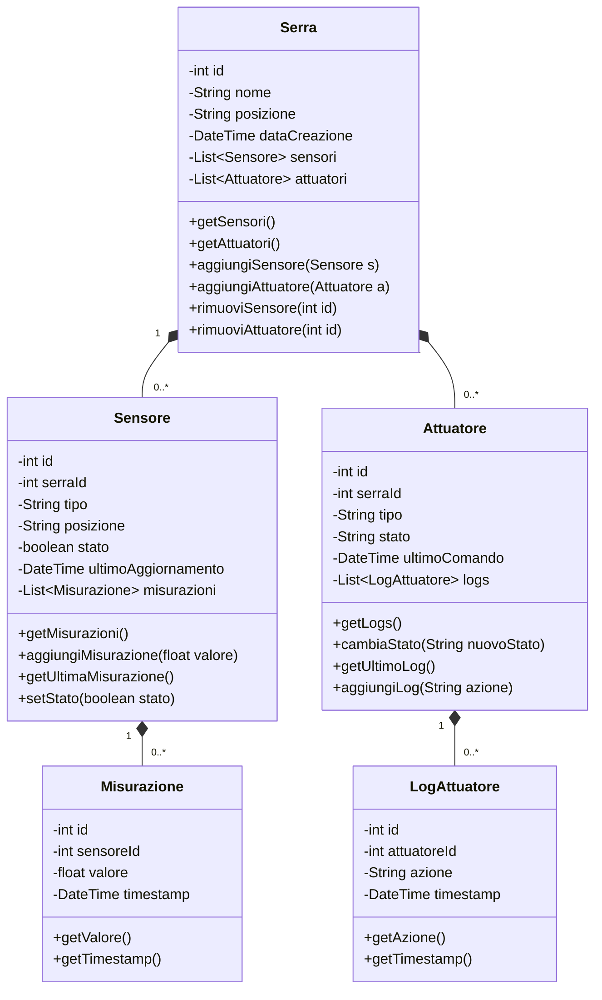

# Diagramma UML del Sistema Serra

## Diagramma delle Classi

## Descrizione delle Classi

### Serra
La classe principale che rappresenta una serra fisica. Contiene:
- Informazioni base come id, nome e posizione
- Liste di sensori e attuatori associati
- Metodi per gestire l'aggiunta e la rimozione di sensori e attuatori

### Sensore
Rappresenta un dispositivo di rilevamento nella serra:
- Mantiene informazioni sul tipo di sensore e la sua posizione
- Traccia lo stato operativo e l'ultimo aggiornamento
- Gestisce una lista di misurazioni
- Fornisce metodi per aggiungere nuove misurazioni e recuperare l'ultima lettura

### Attuatore
Rappresenta un dispositivo di controllo nella serra:
- Mantiene informazioni sul tipo e lo stato corrente
- Traccia l'ultimo comando eseguito
- Gestisce una lista di log delle operazioni
- Fornisce metodi per cambiare stato e registrare le azioni

### Misurazione
Classe per registrare le letture dei sensori:
- Memorizza il valore rilevato e il timestamp
- Collegamenti al sensore che ha effettuato la misurazione
- Metodi per accedere ai dati della misurazione

### LogAttuatore
Classe per tracciare le operazioni degli attuatori:
- Registra l'azione eseguita e il timestamp
- Collegamenti all'attuatore che ha eseguito l'azione
- Metodi per accedere ai dati del log

## Relazioni

1. **Serra - Sensore (1:molti)**
   - Una serra può avere zero o più sensori
   - Ogni sensore appartiene a una sola serra

2. **Serra - Attuatore (1:molti)**
   - Una serra può avere zero o più attuatori
   - Ogni attuatore appartiene a una sola serra

3. **Sensore - Misurazione (1:molti)**
   - Un sensore può avere zero o più misurazioni
   - Ogni misurazione appartiene a un solo sensore

4. **Attuatore - LogAttuatore (1:molti)**
   - Un attuatore può avere zero o più log
   - Ogni log appartiene a un solo attuatore 